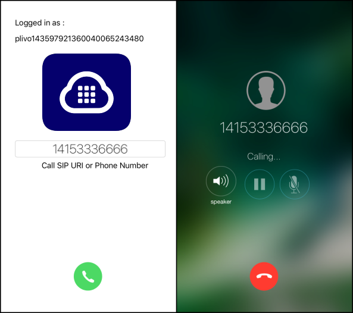

# Plivo Voice Quickstart for iOS


### Introduction

The Plivo iOS SDK v2 allows you to make outgoing and receive incoming calls in your iOS application.
To get started with this quickstart application follow these steps.
- **Outgoing Call:** Follow the below steps to start making outbound calls
    - [Install the PlivoVoiceKit framework using Cocoapods](#bullet1)
    - [Create Endpoints](#bullet2)
    - [Register and Unregister Endpoint](#bullet3)
    - [Run the app](#bullet4)
    -[Plivo iOS SDK V2 with Push Kit integration](#bullet5)
    - [Making an outgoing call](#bullet6)
- **Incoming Call:** You can enable the application to receive incoming calls in the form of push notifications using Apple’s VoIP Service.


### System Requirements

- iOS SDK supports armv7, armv7s, arm64, i386, x86_64 architectures, and iOS 8 & above. 
- You can use Xcode to build this quickstart app.
- Plivo iOS SDK supports IPv6 networks. Users can make and receive calls when their device is connected to a network that uses IPv4, IPv6, or both versions of the protocol.
- Also, supports Pushkit and Callkit. Eliminates the need for persistent connections to receive incoming calls.


### <a name="bullet1"></a> Install the PlivoVoiceKit framework using Cocoapods

It's easy to install the Voice framework if you manage your dependencies using Cocoapods. Simply add the following to your Podfile:
```
pod 'PlivoVoiceKit'
```
[SDK Reference](https://www.plivo.com/docs/sdk/client/ios/reference) - More documentation related to the Voice iOS SDK


### Sign up for an account
Register [here](https://console.plivo.com/accounts/register/) to get your free Plivo account today.

Below are the steps that are to be followed to successfully Sign up for a free trial account.
1. Sign up with your corporate email address
2. You will receive an activation email from Plivo. Click on the link mentioned in the email to activate your account.
3. Enter an sms enabled, non-VOIP number to complete the phone verification.

Sign up with your corporate email address


If you are facing any issues while creating a Plivo account, you can reach out to our [Support Team](https://support.plivo.com/support/home)


### <a name="bullet2"></a> Create Endpoints

You can create an endpoint from the Plivo Console and assign an application to make and receive calls after configuring the endpoint in the quickstart app.


**Note:** You can make use of the demo 'Direct Dial' app in your account for the endpoint which will allow you to make and receive calls for testing purposes.


### <a name="bullet3"></a> Register and Unregister Endpoints

Implement SIP register to Plivo Communication Server

To register with Plivo's SIP and Media server , use a valid sip uri account from plivo web console 
```
var endpoint: PlivoEndpoint = PlivoEndpoint(["debug": true])

// To register with SIP Server
func login( withUserName userName: String, andPassword password: String) {
    endpoint.login(userName, andPassword: password)
}

// To register with SIP Server using device token for getting Push Notifications
func login(withUserName userName: String, andPassword password: String, deviceToken token: Data) {
    endpoint.login(userName, andPassword: password, deviceToken: token)
}

//To unregister with SIP Server
func logout() {
    endpoint.logout()
}
```
If the registration to an endpoint fails the following delegate gets called 
```
(void)onLoginFailedWithError:(NSError *)error;
```

### <a name="bullet4"></a> Run the app
- Clone the [repo](https://github.com/plivo/plivo-ios-quickstart-app) and open SwiftVoiceCallingApp.xcworkspace.
- Change sip endpoint username and password in [Constants](https://github.com/plivo/plivo-ios-quickstart-app/blob/master/plivoIosQuickstartApp/Constants.h).
- Build and run the app.  
- After successful login make VoiceCalls.


### <a name="bullet5"></a> Plivo iOS SDK V2 with Push Kit integration

To enable Pushkit Integration in the SDK the login with deviceToken and relayVoipPushNotification are implemented 
```
//Register pushkit token using the login method as mentioned above
func login(withUserName userName: String, andPassword password: String, deviceToken token: Data) {
    endpoint.login(userName, andPassword: password, deviceToken: token)
}

//receive and pass on (information or a message)
func relayVoipPushNotification(_ pushdata: [AnyHashable: Any]) {
    endpoint.relayVoipPushNotification(pushdata)
}
```
Please refer to this [guide](https://www.plivo.com/docs/sdk/client/ios/setting-up-push-credentials/) to learn about Generating VoIP Certificate.


### <a name="bullet6"></a> Making an outgoing call

###### Make an outgoing call with destination & headers:
Create PlivoOutgoingCall object , then make a call with destination and headers 
```
func call(withDest dest: String, andHeaders headers: [AnyHashable: Any], error: inout NSError?) -> PlivoOutgoing {
    /* construct SIP URI , where kENDPOINTURL is a contant contaning domain name details*/
    let sipUri: String = "sip:\(dest)\(kENDPOINTURL)"
    /* create PlivoOutgoing object */
    outCall = (endpoint.createOutgoingCall())!
    /* do the call */
    outCall?.call(sipUri, headers: headers, error: &error)
    return outCall!
}

//To Configure Audio
func configureAudioSession() {
    endpoint.configureAudioDevice()
}
```
**Note:** configureAudioSession - use this callkit method to set up the AVAudioSession with the desired configuration.

###### Make an outgoing call with destination:
Calling this method on the PlivoOutgoing object with the SIP URI
would initiate an outbound call.
```
(void)call:(NSString *)sipURI error:(NSError **)error;
```

###### Make an outgoing call with destination & custom SIP headers:
Calling this method on the PlivoOutgoing object with the SIP URI
would initiate an outbound call with custom SIP headers.
```
(void)call:(NSString *)sipURI headers:(NSDictionary *)headers error:(NSError **)error;
```



### Receive an incoming call

```
// MARK: PKPushRegistryDelegate
func pushRegistry(_ registry: PKPushRegistry, didUpdate credentials: PKPushCredentials, forType type: PKPushType) {
    if credentials.token.count == 0 {
    print("VOIP token NULL")
    return
    }

    // This method is used to register the device token for VOIP push notifications.
    Phone.sharedInstance.login(withUserName: userName, andPassword: password, deviceToken: credentials.token)
}

//When the push arrives below delegate method will be called. 
func pushRegistry(_ registry: PKPushRegistry, didReceiveIncomingPushWith payload: PKPushPayload, forType type: PKPushType) {
    if (type == PKPushType.voIP) {
    Phone.sharedInstance.relayVoipPushNotification(payload.dictionaryPayload)
    }
}
```
PushInfo is the NSDictionary object forwarded by the apple push notification. This will enable the application to receive incoming calls even the app is not in foreground.

You are now ready to receive incoming calls. 


License

MIT
